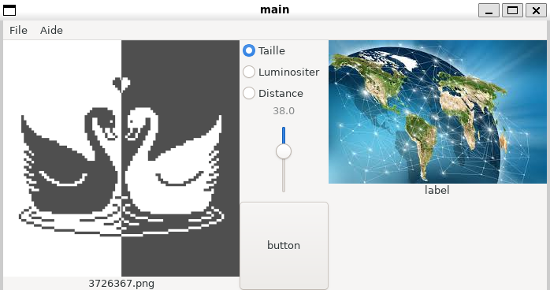

# Application de comprésion d'image Bitmap avec perte en C (Ne fonctionne pas)

### Installation des dépendances :

- **gcc**  
  - ```bash
    sudo apt install gcc
    ```

- **glib**  
  - ```bash
    sudo apt install libglib2.0-dev
    ```

- **gtk**  
  - ```bash
    sudo apt install libgtk-3-dev
    ```

- **pkg-config**  
  - ```bash
    sudo apt install pkg-config
    ```

### Capture d'écran : 



### Acquis :

- **Makefile :**

     ```makefile
    CC = gcc
  CFLAGS = -Wall -W -Wextra -Werror -Wunreachable-code -lm $(shell pkg-config --cflags glib-2.0 gtk+-3.0)
  LDFLAGS = -W -lm $(shell pkg-config --libs glib-2.0 gtk+-3.0)

  SRC = main.c calcul_fonction_zpixel.c calcul_fonction_pixel_image.c calcul_fonction_arbre_zpixel.c fichier.c
  OBJ = $(SRC:.c=.o)
  HEADERS = fonction_zpixel.h fonction_pixel_image.h fonction_arbre_zpixel.h stack2.h calcul_fichier.h
  LIBS = stack2.o

  TARGET = main

  all: $(TARGET)

  $(TARGET): $(OBJ) $(LIBS)
	$(CC) $(CFLAGS) -o $@ $^ $(LDFLAGS)

  %.o: %.c $(HEADERS)
	$(CC) $(CFLAGS) -c $< -o $@

  clean:
	rm -f $(OBJ) $(TARGET)

  .PHONY: all clean
     ```
     
- **Parametre multiples :**

     ```c
    double degradationluminosite(GNode *gnode,...){
    va_list args;
    va_start(args,gnode);
    my_stack_t *mapile=va_arg(args,my_stack_t*);
    if(mapile!=NULL){
        double somme=0;
        int nbelem=stack_mem_used(mapile);
        stack_iterator_t * it=stack_iterator_create(mapile);
        while(nbelem!=0){
            somme+=calculluminositer(((GNode*)stack_iterator_next(it))->data);
            nbelem--;
        }
        stack_iterator_free(it);
        return somme/stack_mem_used(mapile);
    }
    return 0;
  }

     ```

- **Utilisation du fonction en parametre :**
    ```c
    GNode* ConstruireAbreZPixel(int x,int y,int taille,pixelsimages *piximage,FunctionPointer fonction){
    if(x+piximage->largeur<0 || y+piximage->hauteur<0 || x>=piximage->largeur || y>=piximage->hauteur){
        return NULL;
    }
    zpixel *zpix=initialiserzpixelblack(taille,x,y);
    GNode* noeud=g_node_new(zpix);
    if(taille==1){
        zpix->couleur.r=x%256;
        zpix->couleur.g=y%256;
        zpix->couleur.b=(x+y)%256;
    }else{
        my_stack_t * pile=stack_create(4);
        int a=0;
        if((double)taille/2.0!=taille/2){a=1;}
        GNode* filsgh=ConstruireAbreZPixel(x,y,taille/2+a,piximage,fonction);
        if(filsgh!=NULL){
            g_node_prepend(noeud,filsgh);
            stack_push(pile,filsgh);
        }
        GNode* filsdh=ConstruireAbreZPixel(x+taille/2+a,y,taille/2,piximage,fonction);
        if(filsdh!=NULL){
            g_node_prepend(noeud,filsdh);
            stack_push(pile,filsdh);
        }
        GNode* filsgb=ConstruireAbreZPixel(x,y+taille/2+a,taille/2,piximage,fonction);
        if(filsgb!=NULL){
            g_node_prepend(noeud,filsgb);
            stack_push(pile,filsgb);
        }
        GNode* filsdb=ConstruireAbreZPixel(x+taille/2,y+taille/2,taille/2+a,piximage,fonction);
        if(filsdb!=NULL){
            g_node_prepend(noeud,filsdb);
            stack_push(pile,filsdb);
        }
        moyennecouleurzpixel(zpix,pile);
        zpix->factd=fonction(noeud,pile);
        stack_remove(pile);
    }
    return noeud;
  }

    ```
